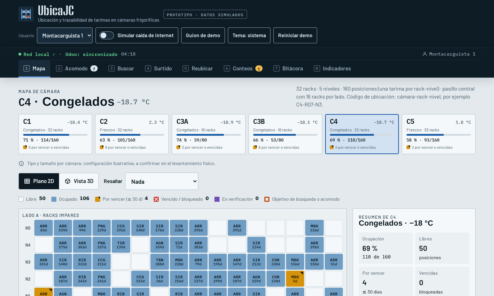

# ANTEPROYECTO

**Proyecto:** UbicaJC, sistema de ubicación y trazabilidad de tarimas para las cámaras de Carnes JC
**Empresa y reto:** Carnes JC, Gestión y Administración de Inventarios (sector Agroindustria y Alimentos)
**Institución:** Instituto Tecnológico de Hermosillo (TecNM)
**Integrantes:** Héctor Rafael Esquer Camacho (Ing. en Sistemas Computacionales), Mauro Acuña Olivarria (Ing. Mecatrónica) y Francisco Efraín Pazos Quintero (Ing. Mecatrónica)
**Asesor:** Jesús Renato Montoya Morales

## Objetivo

Diseñar y probar en una de las cámaras de Carnes JC un sistema que registre en qué rack y nivel está cada tarima y que obligue a confirmar cada movimiento con el escáner, para encontrar el producto más rápido, sacar primero los lotes que caducan antes y seguir trabajando aunque se caiga el internet. El proyecto se desarrollará del 13 de octubre al 27 de noviembre de 2026 y servirá como base para llevar el sistema después a las seis cámaras.

## Objetivos Específicos

1. Conocer a detalle cómo se acomodan, se buscan y se sacan las tarimas en la cámara piloto, y medir cuánto tiempo toma hoy encontrar una tarima.
2. Definir un código único para cada posición de rack (cámara, rack y nivel) y colocar en la cámara piloto etiquetas que resistan el congelamiento.
3. Desarrollar una aplicación que tome de Odoo los datos de producto y lote, y que guarde la ubicación y los movimientos de cada tarima en un servidor dentro de la planta.
4. Programar reglas que sugieran dónde acomodar cada tarima según el tipo de cámara, los espacios libres y la fecha de caducidad.
5. Realizar una prueba piloto con el personal de almacén y comparar los resultados con la medición inicial.
6. Entregar a Carnes JC los resultados del piloto, el costo estimado y un plan para extender el sistema a las seis cámaras.

## Planteamiento del problema

Carnes JC es una empresa sonorense con cerca de 40 años en el mercado y alrededor de 450 colaboradores. Tiene operaciones en Hermosillo, Nogales y Cd. Obregón, vende en varios estados del país y exporta a Japón, Estados Unidos, Canadá, Rusia y Vietnam. En la presentación del reto, la empresa planteó la siguiente pregunta: ¿cómo podemos mejorar la identificación, ubicación y gestión de nuestro inventario para hacer más eficiente la operación de los almacenes?

Durante la visita recorrimos la planta desde la recepción de canales hasta las cámaras. A recepción llegan normalmente dos camiones al día con cerca de 120 canales. Cada canal se registra en Odoo y además se anota a mano en una hoja, y en la misma computadora también se usa un archivo de Excel. Como no hay escáner, todo se teclea; uno de los trabajadores nos comentó que con un escáner podrían recibir unos 40 canales más al día. Después del corte y del empacado al vacío, las cajas se etiquetan y se arma la tarima, que lleva una etiqueta master con código de barras. El montacarguista ya usa una pistola para escanear esa etiqueta, así que la tarima sale de producción bien identificada.

El problema principal lo encontramos en el área de logística. La planta tiene seis cámaras (C1, C2, C3A, C3B, C4 y C5), cuatro de congelados y dos de frescos, con 16 o 32 racks de cinco niveles acomodados a los dos lados de un pasillo, y trabaja con dos montacargas por turno. Las tarimas se dan de alta en un programa que el personal llama "Zorro". Este programa es antiguo, no está conectado con Odoo y depende del internet, por lo que cuando se cae la conexión se quedan sin sistema. Además, solo algunos racks están identificados.

Nos comentaron también lo que pasa en el día a día. Una tarima queda registrada en una ubicación, alguien la saca o la cambia de lugar sin actualizar el sistema, y la siguiente persona que la busca llega al rack y ya no está. Cuando esto ocurre hay que recorrer los pasillos a -18 °C buscando el producto, se pierde tiempo de montacargas y de personal, y se complica sacar primero los lotes que caducan antes. Con base en lo que vimos, identificamos estas causas:

- Nada obliga a registrar una salida o un cambio de lugar en el momento en que se hace.
- Las posiciones de los racks no tienen un código único y no todas están etiquetadas.
- La información se captura dos veces, en Odoo y en Zorro, porque los sistemas no están conectados.
- El sistema de logística deja de funcionar cuando falla el internet.

Si esto no se atiende, seguirán las búsquedas y los retrabajos, crecerá el riesgo de que un lote caduque o de embarcar uno distinto al que correspondía, y una falla de internet seguirá deteniendo la operación. No es un problema exclusivo de Carnes JC: en un estudio con cerca de 370,000 registros de inventario, el 65% no coincidía con lo que había físicamente [1]. Además, para las plantas Tipo Inspección Federal (TIF) la regulación pide poder rastrear el producto por lote [2], la NOM-251-SSA1-2009 pide identificar el producto para aplicar primeras entradas, primeras salidas [3] y Canadá, uno de sus destinos de exportación, exige entregar los registros de un lote en un plazo de 24 horas cuando la autoridad los solicita [4].

## Propuesta de mejora

Proponemos UbicaJC, un sistema que le da una dirección a cada posición de rack, por ejemplo C3A-R07-N3 (cámara C3A, rack 7, nivel 3), y que obliga a escanear la ubicación y la etiqueta master cada vez que una tarima entra, sale o se mueve. De esta forma el sistema siempre sabe qué hay en cada lugar. UbicaJC no reemplaza a Odoo. Toma de Odoo los datos del producto y del lote, y se encarga de la ubicación, que es lo que hoy hace Zorro de forma aislada.

### Funcionamiento

1. Cuando la tarima llega a la cámara, el montacarguista escanea la etiqueta master y el sistema obtiene de Odoo el producto, el lote y las fechas.
2. El sistema sugiere una posición libre en una cámara del tipo correcto (fresco o congelado) y deja más a la mano lo que caduca antes.
3. Al dejar la tarima se escanea la etiqueta del rack. Si no es la posición sugerida, el sistema avisa y registra la posición real.
4. Para buscar un producto o un lote, el sistema muestra en un mapa de la cámara dónde está cada tarima y cuál debe salir primero.
5. Para sacar o mover una tarima se escanean la ubicación y la master. Si falta alguno de los dos escaneos, el movimiento no se registra.
6. Si alguien no encuentra una tarima, la reporta como "no encontrada" y el sistema programa un conteo de esa ubicación para corregir el inventario.

El sistema funcionaría en una computadora dentro de la planta conectada a la red local, así que puede seguir operando aunque se caiga el internet. Cuando regresa la conexión, los cambios se sincronizan con Odoo.

Para explicar mejor la idea hicimos un prototipo navegable con datos simulados. Se puede consultar en:
https://raw.githack.com/mauspaces/Carnes-JC-J-venes-Impulsando-la-industia/ccr-bc79c691-0nmbnx/prototipo/demo.html

### Tecnología y costos

La idea es aprovechar lo que la empresa ya tiene: Odoo, las etiquetas master y las pistolas de escaneo. Odoo ya maneja lotes con fecha de caducidad y la estrategia de salida FEFO (primero en caducar, primero en salir) [5], pero sus reglas de acomodo no toman en cuenta la caducidad, por eso esa parte la haría UbicaJC. Para las ubicaciones usaríamos etiquetas de código de barras con adhesivo para congelación, que se pueden colocar a temperaturas de hasta -23 °C [6], ya que las etiquetas normales se despegan con el frío. Descartamos el uso de RFID porque el agua y el hielo de la carne afectan la lectura de las etiquetas.

**Tabla I.** Costo estimado del equipo para la prueba piloto.

| Concepto | Costo estimado (MXN) |
|---|---|
| Etiquetas de ubicación para congelación (80 a 160 posiciones) | 1,000 a 4,000 |
| Computadora local (mini PC) | 3,600 a 7,400 |
| No break (UPS) | 1,400 a 2,900 |
| Lector inalámbrico, solo si las pistolas actuales no sirven en la cámara | 14,700 |
| Software | Desarrollo propio, sin licencias |

Usando las pistolas actuales, el equipo para el piloto costaría entre $6,600 y $15,700 pesos aproximadamente, considerando un 10% de imprevistos. Son precios de tiendas en línea que cotizaremos con proveedores en la semana 2, y la compra del equipo correría a cargo de Carnes JC.

### Prueba piloto

La prueba se haría en una cámara elegida junto con Carnes JC; sugerimos una de congelados de 16 racks, que tiene alrededor de 80 posiciones. Los primeros dos días el sistema trabajaría en paralelo con Zorro y, si la empresa lo autoriza, los dos días siguientes solo con UbicaJC. Durante el piloto no se escribirá nada en Odoo, únicamente se leerán sus datos.

### Recepción de canales

Aunque el proyecto se enfoca en las cámaras, también entregaremos una propuesta para recepción. Como la etiqueta del canal no parece tener código de barras, evaluaremos tres opciones: pedir al proveedor que lo incluya, leer el número impreso con la cámara de una tablet o imprimir una etiqueta interna al recibir el canal. Con cualquiera de ellas se podría dejar de capturar en la hoja y en Excel, y se validaría con mediciones la estimación de 40 canales más por día.

### Alcance y riesgos

Como lo marca la convocatoria, el proyecto llega hasta la etapa de diseño, validado con un piloto en una cámara. No incluye instalar el sistema en las seis cámaras ni hacer cambios en Odoo o en Zorro. El nombre UbicaJC es una propuesta; la marca JC pertenece a Carnes JC. Los principales riesgos que vemos son que no se pueda conectar a Odoo (en ese caso trabajaríamos con archivos exportados), que las pistolas o las etiquetas no funcionen bien en el frío (las probaremos en la semana 2) y que el personal no escanee todos los movimientos durante el piloto, lo cual atenderemos con capacitación y revisiones diarias.

### Impacto esperado

En lo económico, el sistema permitirá reducir las horas de montacargas y de personal dedicadas a buscar producto, así como la merma por lotes que caducan sin encontrarse a tiempo. En la operación, eliminará la doble captura y la dependencia del internet. En calidad, mejorará la trazabilidad por lote que piden las normas y los clientes de exportación. Para el personal, reducirá el tiempo de permanencia dentro de las cámaras a -18 °C, condición para la que la NOM-015-STPS-2001 establece límites de exposición [7]. Por último, menos tiempo de búsqueda también significa menos tiempo con la puerta de la cámara abierta y, por lo tanto, un menor gasto de energía.

## Metas

Las metas se confirmarán con Carnes JC al terminar la semana 1, cuando tengamos la medición inicial de la cámara piloto.

**Tabla II.** Metas del proyecto y forma de medirlas.

| Meta | Cómo la vamos a medir |
|---|---|
| Reducir al menos 50% el tiempo promedio para encontrar una tarima | 20 búsquedas en la semana 1 y 20 durante el piloto, en las mismas condiciones |
| Lograr 97% o más de coincidencia entre la ubicación registrada y la real | Revisión de 30 ubicaciones elegidas al azar |
| Que el 100% de los movimientos del piloto se hagan con doble escaneo | Observación de 20 movimientos y bitácora del sistema |
| Que el sistema siga funcionando en todas las pruebas sin internet | 5 cortes de conexión simulados, sin perder movimientos |
| Eliminar la doble captura en la cámara piloto | Comparación del registro antes y durante el piloto |
| Que todas las salidas sigan la sugerencia FEFO o registren el motivo | Bitácora de salidas del piloto |
| Cumplir al menos el 90% de las tareas programadas cada semana | Indicadores PPC y PAER vistos en el taller |

## Cronograma (7 semanas)

**Tabla III.** Cronograma de actividades.

| Semana | Fechas | Actividades | Responsable |
|---|---|---|---|
| 1 | 13 al 16 de octubre | Elegir la cámara piloto con Carnes JC, levantamiento físico, revisión del proceso actual y de Odoo, medición inicial | Todo el equipo |
| 2 | 19 al 23 de octubre | Diseño de la codificación de ubicaciones y de las reglas de acomodo, prueba de etiquetas y pistolas en frío, cotización del equipo | Mauro y Pazos, con Héctor en el diseño del sistema |
| 3 | 26 al 30 de octubre | Instalación del servidor local, lectura de datos de Odoo, registro de entradas y búsquedas, etiquetado de la cámara | Héctor y Pazos, con Mauro en el etiquetado |
| 4 | 3 al 6 de noviembre | Reglas de acomodo, salidas, reubicaciones, conteos y mapa de la cámara; demostración a Carnes JC | Héctor y Mauro |
| 5 | 9 al 13 de noviembre | Pruebas completas en la cámara, pruebas sin internet, manual de usuario y capacitación | Pazos, con apoyo de Héctor y Mauro |
| 6 | 17 al 20 de noviembre | Prueba piloto y mediciones finales | Todo el equipo |
| 7 | 23 al 27 de noviembre | Análisis de resultados, costo-beneficio, plan para las seis cámaras e informe final | Todo el equipo |

Cada integrante dedicará alrededor de 15 horas por semana. Héctor se encargará principalmente del software y la conexión con Odoo; Mauro, del levantamiento físico, la codificación de ubicaciones, el mapa y las mediciones, y Pazos, de la red local, el equipo y las etiquetas para frío, las pruebas y la capacitación. Cada viernes revisaremos el avance con los indicadores PPC y PAER que vimos en el taller, y tendremos una reunión semanal con el personal de almacén de Carnes JC para validar cada etapa. Al cerrar, entregaremos un plan de seguimiento basado en el ciclo PDCA para que la empresa pueda mantener y extender el sistema.

## Referencias

[1] N. DeHoratius y A. Raman, "Inventory record inaccuracy: An empirical analysis," *Management Science*, vol. 54, no. 4, pp. 627–641, 2008.

[2] Reglamento de la Ley Federal de Sanidad Animal, art. 25, Diario Oficial de la Federación, México, 2012. [En línea]. Disponible: https://www.diputados.gob.mx/LeyesBiblio/regley/Reg_LFSA.pdf

[3] Secretaría de Salud, "NOM-251-SSA1-2009, Prácticas de higiene para el proceso de alimentos, bebidas o suplementos alimenticios," Diario Oficial de la Federación, México, 2010.

[4] Canadian Food Inspection Agency, "Traceability requirements, Safe Food for Canadians Regulations." [En línea]. Disponible: https://inspection.canada.ca/en/food-safety-industry/toolkit-food-businesses/traceability-requirements

[5] Odoo S.A., "FEFO removal strategy," Odoo 19.0 Documentation. [En línea]. Disponible: https://www.odoo.com/documentation/19.0/applications/inventory_and_mrp/inventory/shipping_receiving/removal_strategies/fefo.html

[6] Zebra Technologies, "Zebra 8000T Freezer labels," ficha de producto. [En línea]. Disponible: https://www.levata.com/zebra-8000t-freeze-labels

[7] Secretaría del Trabajo y Previsión Social, "NOM-015-STPS-2001, Condiciones térmicas elevadas o abatidas. Condiciones de seguridad e higiene," Diario Oficial de la Federación, México, 2002.
